# Welcome to TiKit UI Components

<div align="center">


</div>

TiKit is a collection of UI components for **Titanium** built on top of **Alloy** and **PurgeTSS**.

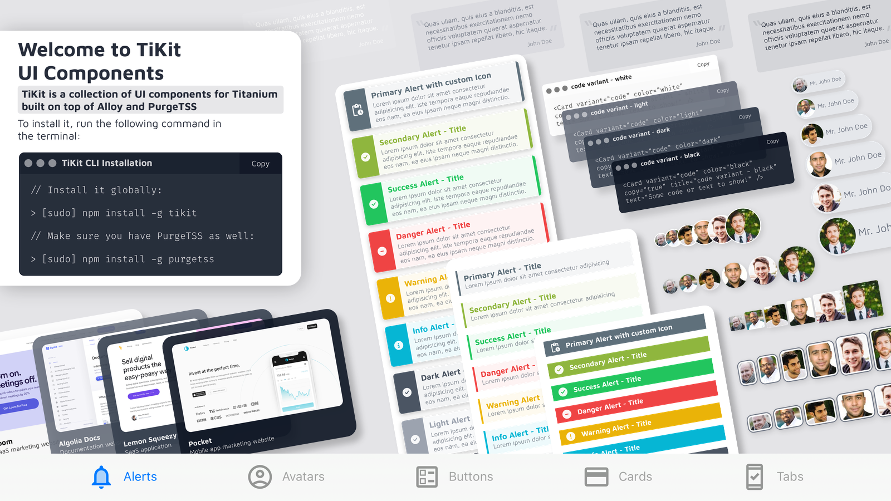

## Installation
To install it, run the following command in the terminal:

```bash
> [sudo] npm install -g tikit
```

Make sure you have **PurgeTSS** as well:

```bash
> [sudo] npm install -g purgetss
```

## Installing the components
Once everything is installed on your machine, create a new Alloy project using **PurgeTSS**, *make sure you have `app.idprefix` and `app.idprefix` [settings configured.](https://purgetss.com/docs/commands/#requirements)*

```bash
> purgetss create myApp
```

Then, run `tikit install` and follow an interactive select prompt:

```bash
> tikit install
? Choose a component to install › - Use arrow-keys. Return to submit.
❯   all components
    alerts
    avatars
    buttons
    cards
```

# Available components and their variants

## Alerts
> ### General properties: variant, color and classes

An alert displays a short and important message attracting the user’s attention without interrupting the user’s task.

**TiKit Alert Component contains 3 variants:**
* callout
* pop
* solid

**With 6 main colors each**: *success*, *danger*, *warning*, *info*, *dark* and *light*.

**And 2 custom colors for each variant called**: *primary* and *secondary*.

You can add your own color values using the `shades` command in **PurgeTSS**:

```bash
> purgetss shades '#hexcode1' primary
> purgetss shades '#hexcode2' secondary
```

> ### Additional properties: delay, duration and dismissible

Use `delay` to display the alert after a period of time and `duration` to set the speed of the animation. Both properties are in milliseconds.

Set the `dismissible` property to true to close it when the user clicks/taps on it.

```xml
<Alert variant="pop" color="info" delay="500" dismissible="true" module="tikit.ui" title="Dismissible Alert" text="Lorem ipsum dolor sit..." />
```

### callout
> ### Properties: title and text

A simple Alert with a title and brief description.

```xml title="callout variant"
<Alert variant="callout" color="success" module="tikit.ui" title="Callout variant" text="Lorem ipsum dolor sit..." />
```

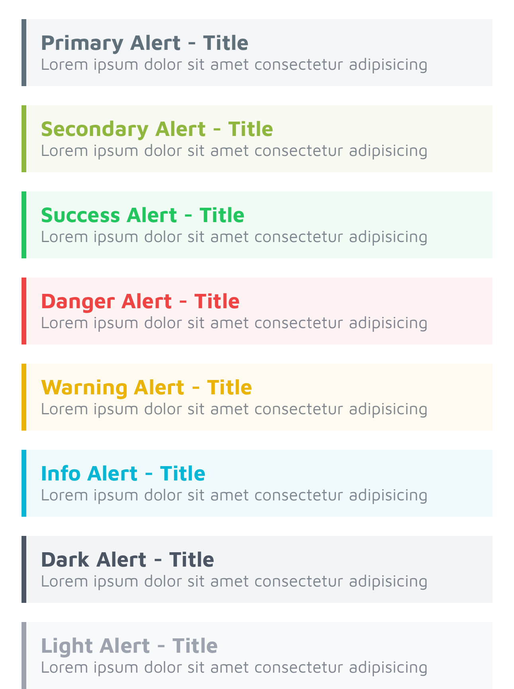


### pop
> ### Properties: title, text and icon

Alerts with a predefined icon to emphasize a message.

You can use icon fonts such as FontAwesome, Material Icons or any other icon font of your choice.

Change the icon using the `icon` property and its size with any of **PurgeTSS**’s font size classes:

```xml title="pop variant with custom icon"
<Alert variant="pop" color="primary" module="tikit.ui" title="Primary Alert with custom Icon" text="Lorem ipsum dolor sit..." icon="mi mi-pending_actions text-3xl" />
```

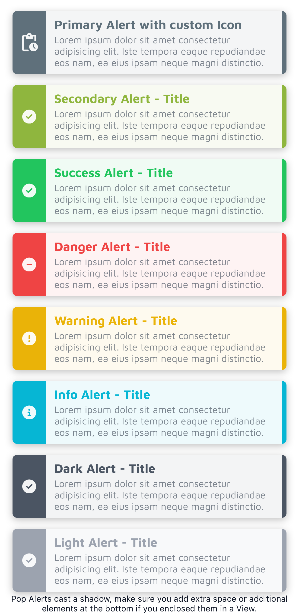

### solid
> ### Properties: title and icon

A full-width, solid banner with a title and a predefined icon.

Just like the `pop` variant, you can change its icon using the `icon` property and its size with any of **PurgeTSS**’s font size classes.

```xml title="solid variant with custom icon"
<Alert variant="solid" color="primary" title="Primary Alert with custom Icon" icon="mi mi-pending_actions text-2xl" module="tikit.ui" />
```

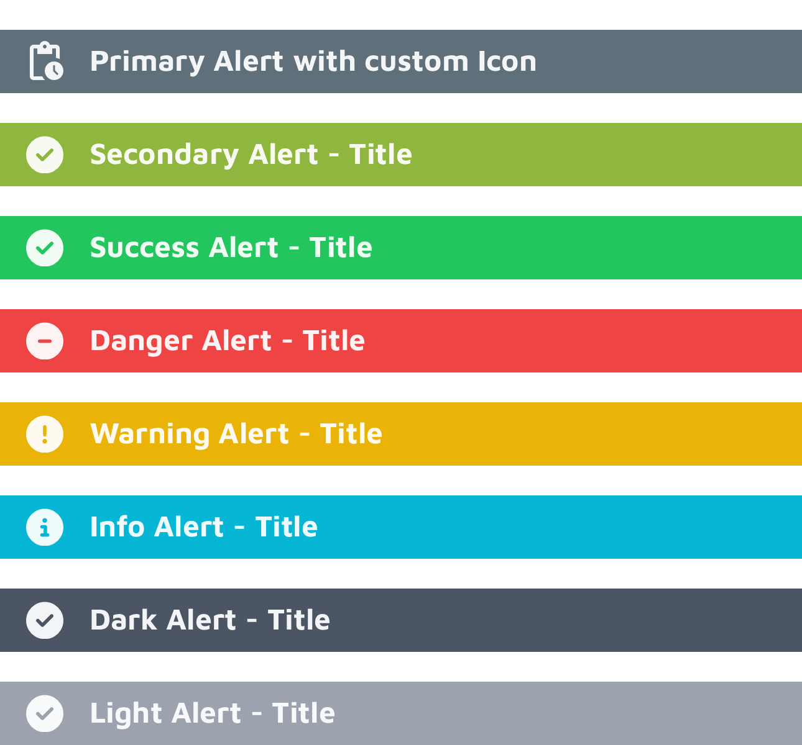

## Avatars
> ### General properties: variant, size and classes

Use Avatars to portray people or objects. It can be used as a visual identifier for a user profile on your app.

**TiKit Avatar Component contains 6 variants:**
* chip
* circular
* square
* portrait
* landscape
* stacked

**With 6 different sizes each**: *xs*, *sm*, *base*, *lg*, *xl* and *2xl*.

```xml title="Avatar Component"
<Avatar variant="chip" size="base" module="tikit.ui" name="John Doe" image="link-to-image.jpg" />
```

### chip
> ### Properties: name and image

Set the name of the person and an image to display, using a local filesystem path, a remote URL, or a Blob object containing image data.

The default colors are `bg-gray-200` and `text-gray-500`. To change them use the `classes` property, like the example below.

```xml title="chip variant with custom colors"
<Avatar variant="chip" size="base" name="Mr. John Doe" image="https://randomuser.me/api/portraits/men/86.jpg" classes="bg-violet-900 text-violet-50" />
```

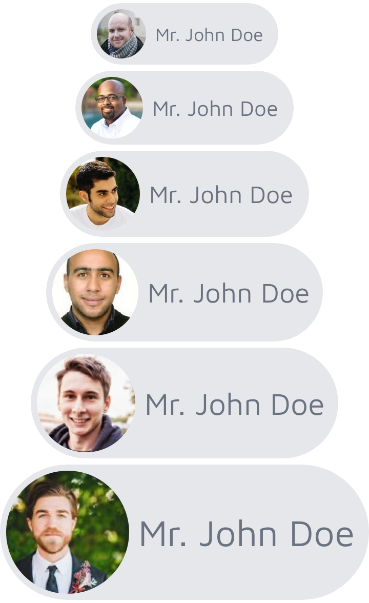


### circular
> ### Properties: name, image and border

Set `border` to true to show a white border around the image.

Use the `classes` prop to change the border color.

```xml title="circular variant with custom colors"
<Avatar variant="circular" size="base" module="tikit.ui" border="true" image="https://randomuser.me/api/portraits/men/86.jpg" />
```


### square
> ### Properties: name, image and border

Set `border` to true to show a white border around the image.

Use the `classes` prop to change the border color.

```xml title="square variant with custom colors"
<Avatar variant="square" size="base" module="tikit.ui" border="true" classes="border-violet-900" image="https://randomuser.me/api/portraits/men/86.jpg" />
```


### portrait
> ### Properties: name and image

Use the `classes` prop to change the border color.

The default border color is `border-gray-500`, use the `classes` prop to change it.

```xml title="portrait variant with custom colors"
<Avatar variant="portrait" size="base" module="tikit.ui" classes="border-violet-900" image="https://randomuser.me/api/portraits/men/86.jpg" />
```


### landscape
> ### Properties: name and image

Use the `classes` prop to change the border color.

The default border color is `border-gray-500`, use the `classes` prop to change it.

```xml title="landscape variant with custom colors"
<Avatar variant="landscape" size="base" module="tikit.ui" classes="border-violet-900" image="https://randomuser.me/api/portraits/men/86.jpg" />
```


### stacked
> ### Properties: title, icon and last

To properly adjust the right margin of the last avatar in a stack, set its `last` property to true.

```xml title="stacked variant"
<View class="horizontal">
  <Avatar variant="stacked" size="base" module="tikit.ui" image="https://randomuser.me/api/portraits/men/86.jpg" />
  <Avatar variant="stacked" size="base" module="tikit.ui" image="https://randomuser.me/api/portraits/men/87.jpg" />
  <Avatar variant="stacked" size="base" module="tikit.ui" image="https://randomuser.me/api/portraits/men/62.jpg" />
  <Avatar variant="stacked" size="base" module="tikit.ui" last="true" image="https://randomuser.me/api/portraits/men/88.jpg" />
</View>
```


## Buttons
> ### General properties: variant, size and classes

Buttons allow the user to take actions or make choices.

**TiKit Button Component contains 6 variants:**
* border
* border-rounded
* filled
* filled-rounded
* icon-left
* icon-right

**With 6 different sizes each**: *xs*, *sm*, *base*, *lg*, *xl* and *2xl*.

```xml
<Button module="tikit.ui" variant="border" size="lg" title="Button Name" />
```


### border
> ### Property: title

Use the `classes` property to change the color of the title and border:

```xml title="border variant"
<Button variant="border" size="base" title="Border" module="tikit.ui" classes="border-violet-900 text-violet-900" />
```

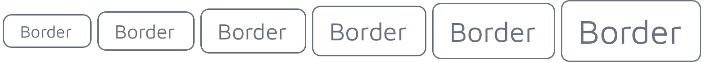


### border-rounded
> ### Property: title

Use the `classes` property to change the color of the title and border:

```xml title="border-rounded variant"
<Button variant="border-rounded" size="base" title="Border Rounded" classes="border-violet-900 text-violet-900" module="tikit.ui" />
```

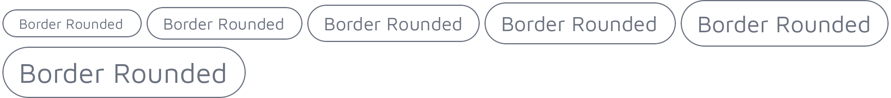


### filled
> ### Property: title

Use the `classes` property to change the color of the title and background:

```xml title="filled variant"
<Button variant="filled" size="base" title="Filled" module="tikit.ui" classes="text-violet-50 bg-violet-900" />
```

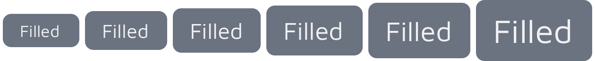


### filled-rounded
> ### Property: title

Use the `classes` property to change the color of the title and background:

```xml title="filled-rounded variant"
<Button variant="filled-rounded" size="base" title="Filled Rounded" classes="text-violet-50 bg-violet-900" module="tikit.ui" />
```

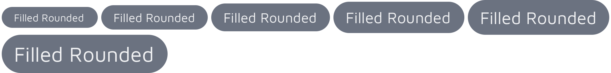


### icon-left
> ### Properties: title and icon

Use the `icon` property to change its icon, color and size.

Use the `classes` property to change the color of the title and background:

```xml title="icon-left variant"
<Button variant="icon-right" size="base" module="tikit.ui" title="Button" icon="fa fa-file text-violet-50" classes="text-violet-50 bg-violet-900" />
```

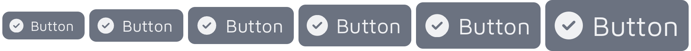


### icon-right
> ### Properties: title and icon

Use the `icon` property to change its icon, color and size.

Use the `classes` property to change the color of the title and background:

```xml title="icon-right variant"
<Button variant="icon-left" size="base" module="tikit.ui" title="Button" icon="fa fa-file text-violet-50" classes="text-violet-50 bg-violet-900" />
```

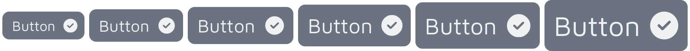


### Custom Icons
> ### Use any Icon Font Library

You can change to a different icon from the FontAwesome Icon Library or even to a different font vendor by setting the `icon` property with the font and icon classes, ej. `fa fa-file-pdf` or `mi mi-pending_actions`

You can even change its size with any of **PurgeTSS**’s font size classes, such as `text-lg` or `text-2xl`.

In this example, we are using the Material Icons font library.

```xml title="Custom icon and color"
<Button module="tikit.ui" variant="icon-left" size="base" icon="mi mi-pending_actions text-2xl text-violet-50" title="Pending Actions" classes="my-4 font-bold bg-violet-900" />
```


## Cards
> ### General properties: variant, color and classes

Cards are used to group and display content in a way that is easily readable, it serves as an entry point to more detailed information.

**TiKit Card Component contains 4 variants:**
* code
* content
* quote
* showcase

**With 4 colors each**: *black*, *dark*, *light* and *white*.

```xml
<Card variant="code" color="black" module="tikit.ui" copy="true" title="Card Title" text="Some code or text to display!" />
```


### code
> ### Properties: title, text and copy

To display small snippets of code.

Use the `copy` property to display a copy button at the top-right corner.

The button’s title and the alert message are set with Titanium’s localization function: `L('copy', 'Copy')` and `L('code_copied', 'Code copied to clipboard!')` respectibly, so add both strings: `copy` and `code_copied` to your app’s target languages (`app/i18n/xx/strings.xml`) for personalization and translation.

Install a monotype family of your preference and create a `font-mono` style in `./purgetss/config.js`.

We are using `FiraCode-Light` font family in all examples.

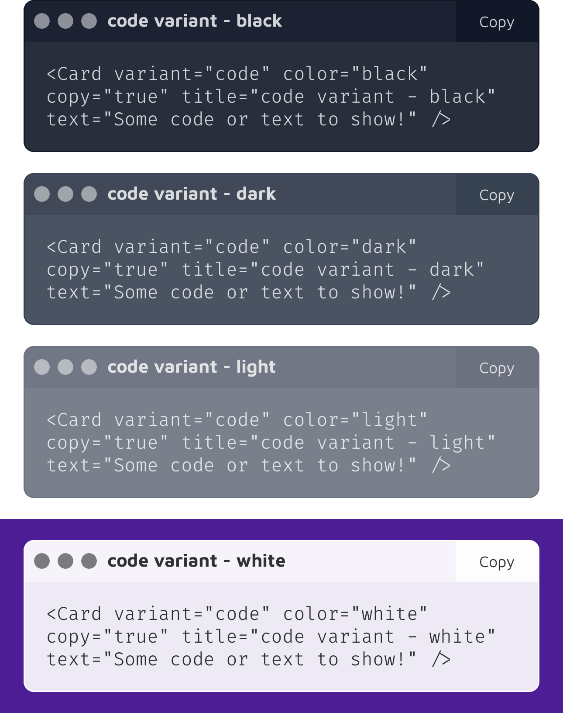


### showcase
> ### Properties: title, text and image

When you need to display an image with a title and a small description.

```xml title="showcase variant"
<Card variant="showcase" color="black" title="Pocket" text="Mobile app marketing website" image="images/showcase/1.png" />
```


### quote
> ### Properties: name and text

When you need to display a quote from someone.

```xml title="quote variant"
<Card variant="quote" color="black" name="John Doe" text="Quas ullam, quis eius a blanditiis..." />
```

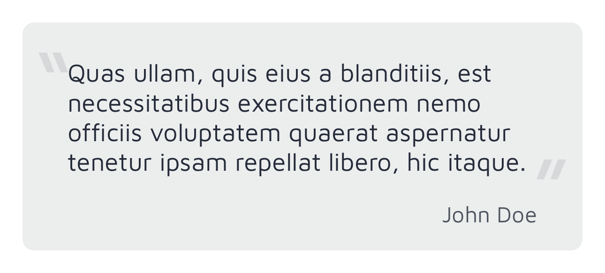


### content
> ### Properties: title, subtitle and text

Display a block of text with a large title, a highlighted subtitle and paragraphs of text.

```xml title="content variant"
<Card variant="content" color="black" title="content variant, black" subtitle="This is a subtitle" text="Alloy.Globals.lorem" />
```

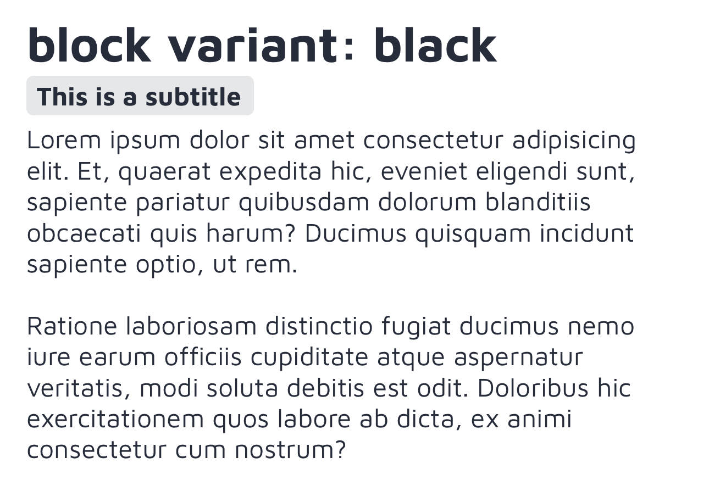


## Tabs
The Tab component returns an instance of **Titanium.UI.Tab** that includes a custom icon created with an icon font such as FontAwesome, Material Icons or any other icon font of your choice.

By setting the `title`, `icon` and `activeIcon` (iOS only) properties, you’ll get a Tab component with the icons nicely rendered.

The `icon` property is defined with the icon font name and the icon code, for example: `fa fa-home` or `mi mi-home`.

```xml title="Tab component"
<Tab title="Email" icon="far fa-envelope" activeIcon="fas fa-envelope" module="tikit.ui">
  <!-- tab’s-window-content -->
</Tab>
```

### Additional properties

These are regular **Titanium.UI.Tab** objects, so you can use all the properties and methods available for them.

For example you can set active tint and title color for each tab by using the `activeTintColor` and `activeTitleColor` properties like this:

```xml
<Tab class="active-tint-violet-900 active-title-violet-900" title="Tabs" icon="mio mi-security_update_good text-3xl" activeIcon="mit mi-security_update_good text-3xl" module="tikit.ui">
  <Require src="sections/tabs" />
</Tab>
```

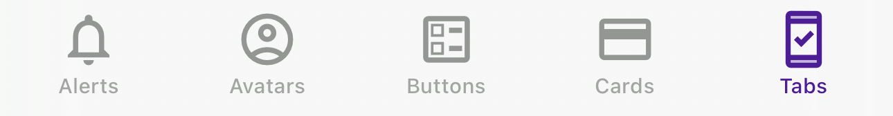

## Free Icon Libraries
To copy the free versions of Font Awesome, Material Icons, Material Symbols or Framework7 Icons to your project, use the `copy-fonts` command in **PurgeTSS**:

```bash
> purgetss copy-fonts --vendor=fa,mi,ms,f7

• fa, fontawesome = Font Awesome Icons
• mi, materialicons = Material Icons
• ms, materialsymbol = Material Symbols
• f7, framework7 = Framework7 Icons
```
