# 👋 Welcome to TiKit UI Components!

<div align="center">


</div>

Building beautiful, consistent UIs in **Titanium SDK** can sometimes feel like a chore. That's where TiKit comes in! It's a growing collection of handy UI components built with **Alloy** and **PurgeTSS** to make your life easier. Think of it as your toolkit for creating slick, modern mobile app interfaces without reinventing the wheel every time.

We designed TiKit to help you ship faster and focus on what makes your app unique, not wrestling with styling details.

### Why You'll Like TiKit:

  * **Ready-to-Go Components**: Grab Alerts, Avatars, Buttons, Cards, Forms, and Tabs right out of the box, with different looks and options.
  * **Style Flexibly with PurgeTSS**: Uses PurgeTSS utility classes, so you can tweak styles easily without writing mountains of TSS.
  * **Update Components on the Fly**: Change properties like text or images dynamically without rebuilding the whole component. Nifty!
  * **Icons Included**: Easily use FontAwesome, Material Icons, and other popular icon fonts.
  * **Consistent Look & Feel**: Components are designed to work well together, giving your app a polished vibe.
  * **Make It Your Own**: Customize colors and styles to match your brand identity.
  * **Light & Fast**: Built with performance in mind, so it won't weigh your app down.
  * **Smart Defaults**: Each component comes with sensible default values, so you only need to provide what's unique to your use case.

In short, TiKit helps you build great-looking Titanium apps faster. Less UI hassle, more building awesome features!

<p align="center">
  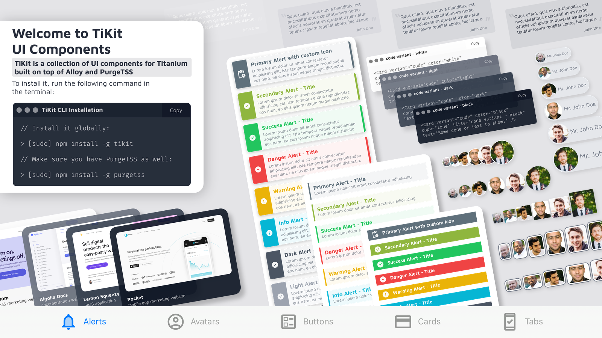
</p>

## Getting Started

First, you'll need the TiKit CLI. Open your terminal and run:

```bash
# Might need 'sudo' depending on your setup
npm install -g tikit
```

Make sure you also have **PurgeTSS** installed globally:

```bash
# Might need 'sudo' here too
npm install -g purgetss
```

## Setting Up Your Project

1.  **Create a PurgeTSS Project**: If you haven't already, create a new Alloy project using PurgeTSS. *Make sure you've configured the `app.idprefix` and `app.theme` settings as [required by PurgeTSS](https://purgetss.com/docs/commands/#requirements).*

    ```bash
    purgetss create myApp
    # Follow the prompts
    ```

2.  **Install TiKit Components**: Navigate into your new project directory (`cd myApp`) and run the TiKit installer. It'll guide you through picking the components you want:

    ```bash
    tikit install
    # ? Choose a component to install › - Use arrow-keys. Return to submit.
    # ❯   all components
    #     alerts
    #     avatars
    #     buttons
    #     cards
    #     forms
    ```

## Component Default Values

TiKit components are designed to work right out of the box with sensible defaults. Here's a summary of what each primary component uses as defaults when not specified:

| Component   | Property  | Default Value                                                                  | Description                  |
| ----------- | --------- | ------------------------------------------------------------------------------ | ---------------------------- |
| **Alerts**  | `color`   | `"dark"`                                                                       | The alert's color scheme     |
|             | `variant` | `"pop"` (with text) or `"solid"` (without text)                                | The alert's visual style     |
| **Avatars** | `size`    | `"base"`                                                                       | The avatar's size            |
|             | `variant` | `"chip"` (with name) or `"square"` (without name)                              | The avatar's shape and style |
| **Buttons** | `size`    | `"base"`                                                                       | The button's size            |
|             | `variant` | `"icon-left"` (with icon) or `"filled"` (without icon)                         | The button's visual style    |
| **Cards**   | `color`   | `"dark"`                                                                       | The card's color scheme      |
|             | `variant` | `"showcase"` (with image) or `"content"` (with subtitle) or `"code"` (default) | The card's layout style      |
| **Forms**   | `color`   | `"dark"`                                                                       | The form field's color scheme |
|             | `variant` | `"input"`                                                                      | The form field's layout style |

This means you can use components with minimal properties. For example:

```xml
<!-- Uses variant="pop", color="dark" by default -->
<Alert module="tikit.ui" title="Simple Alert" text="With default values" />

<!-- Uses variant="square", size="base" by default -->
<Avatar module="tikit.ui" image="path/to/image.jpg" />

<!-- Uses variant="filled", size="base" by default -->
<Button module="tikit.ui" title="Default Button" />

<!-- Uses variant="code", color="dark" by default -->
<Card module="tikit.ui" title="Simple Card" text="Using defaults" />

<!-- Uses variant="content" when subtitle is provided -->
<Card module="tikit.ui" title="Card with Subtitle" subtitle="Important info" text="Some details" />

<!-- Uses variant="showcase" when image is provided -->
<Card module="tikit.ui" title="Image Card" text="With an image" image="path/to/image.jpg" />

<!-- Uses variant="input", color="dark" by default -->
<Form module="tikit.ui" label="Email" hintText="you@example.com" />
```

These defaults make it faster to build interfaces by requiring fewer parameters for common use cases.

## Available Components & How to Use Them

Let's dive into what TiKit offers!

-----

## Alerts

> **Common Properties:** `variant`, `color`, `classes`, `title`, `text`

Need to show a short, important message without interrupting the user? Alerts are perfect for that.

**TiKit Alert Variants:**

  * `callout`: Simple message with title and text.
  * `pop`: Includes an icon alongside the title and text.
  * `solid`: A full-width banner style, usually with just a title and icon.

**Colors:** Each variant comes in `success`, `danger`, `warning`, `info`, `dark`, and `light`. You can also define `primary` and `secondary` custom colors using PurgeTSS:

```bash
# Define your brand colors
purgetss shades '#yourHexCode1' primary
purgetss shades '#yourHexCode2' secondary
```

**Extra Controls:**

  * `delay` (milliseconds): Wait before showing the alert.
  * `duration` (milliseconds): Control the animation speed.
  * `dismissible` (boolean): Set to `true` to let users tap/click the alert to close it.

<!-- end list -->

```xml
<Alert module="tikit.ui" variant="pop" color="info" delay="500" dismissible="true" title="Just FYI" text="You can tap this alert to close it." />
```

### `callout`

> **Properties:** `title`, `text`

A basic alert for straightforward messages.

```xml title="Callout Variant Example"
<Alert module="tikit.ui" variant="callout" color="success" title="Success!" text="Your changes have been saved." />
```

<p align="center">
  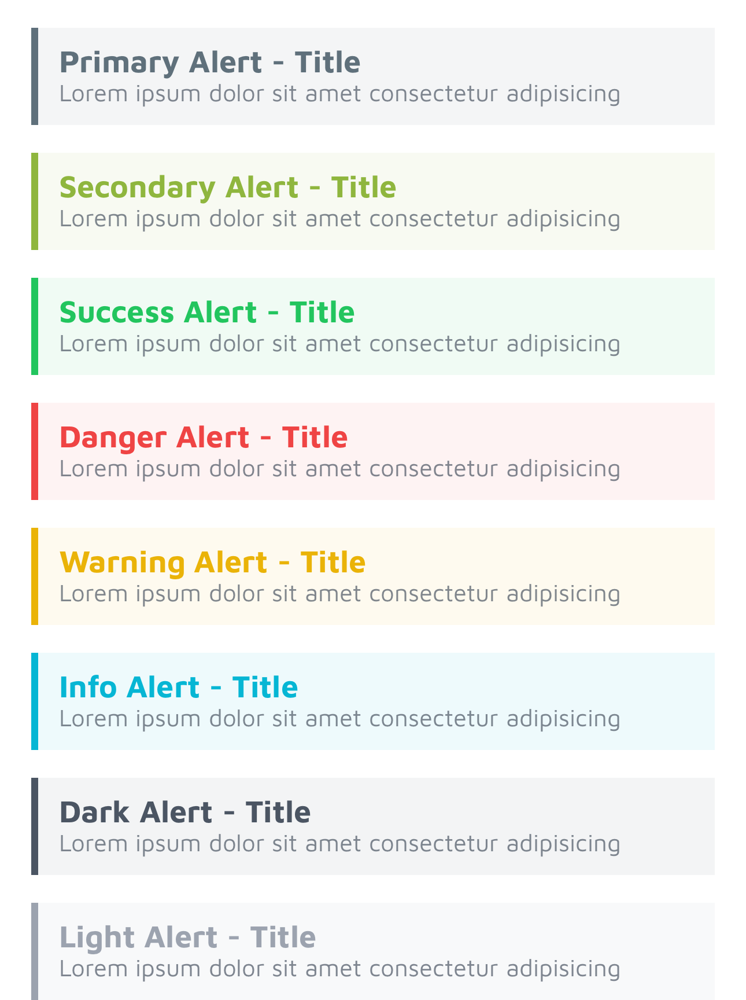
</p>

### `pop`

> **Properties:** `title`, `text`, `icon`

Adds a visual cue with an icon. You can customize the icon and its size using PurgeTSS classes in the `icon` property.

```xml title="Pop Variant with Custom Icon"
<Alert module="tikit.ui" variant="pop" color="primary" title="Action Required" text="Please review the details." icon="mi mi-pending_actions text-3xl" />
```

<p align="center">
  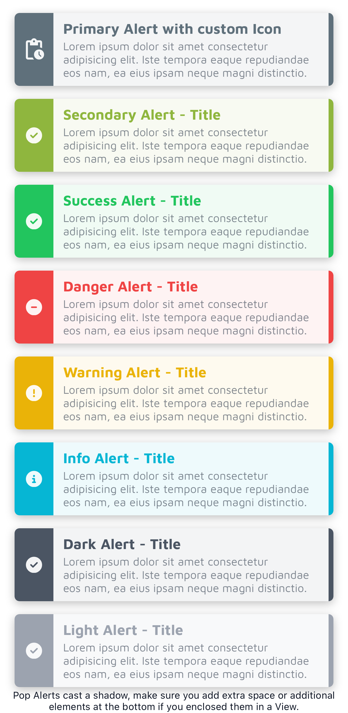
</p>

### `solid`

> **Properties:** `title`, `icon`

A bold, full-width banner. Great for prominent notifications. Customize the icon just like the `pop` variant.

```xml title="Solid Variant with Custom Icon"
<Alert module="tikit.ui" variant="solid" color="warning" title="Maintenance Soon" icon="mi mi-warning text-2xl" />
```

<p align="center">
  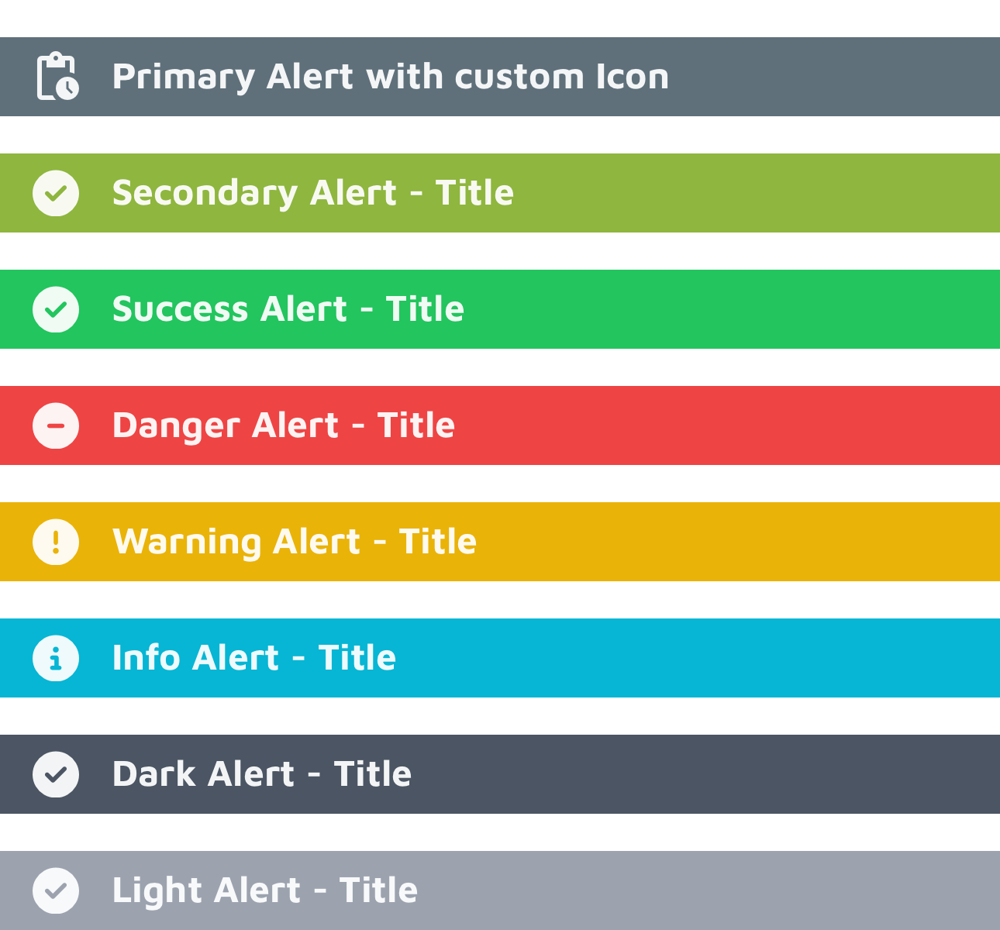
</p>

-----

## Avatars

> **Common Properties:** `variant`, `size`, `classes`, `image`

Great for representing users or objects visually.

**TiKit Avatar Variants:**

  * `chip`: Image with a name label next to it.
  * `circular`: Standard round avatar.
  * `landscape`: Rectangular, wider than tall.
  * `portrait`: Rectangular, taller than wide.
  * `square`: Simple square avatar.
  * `stacked`: Designed to overlap slightly in a horizontal group.

**Sizes:** Available in `xs`, `sm`, `base`, `lg`, `xl`, and `2xl`.

```xml title="Basic Avatar Example"
<Avatar module="tikit.ui" variant="circular" size="lg" image="path/to/your/image.jpg" />
```

### `chip`

> **Properties:** `name`, `image`

Shows an image and a name. Good for lists or mentions. Default background/text is gray, but you can change it with `classes`.

```xml title="Chip Variant with Custom Colors"
<Avatar module="tikit.ui" variant="chip" size="base" name="Jane Doe" image="https://randomuser.me/api/portraits/women/86.jpg" classes="bg-blue-100 text-blue-800" />
```

<p align="center">
  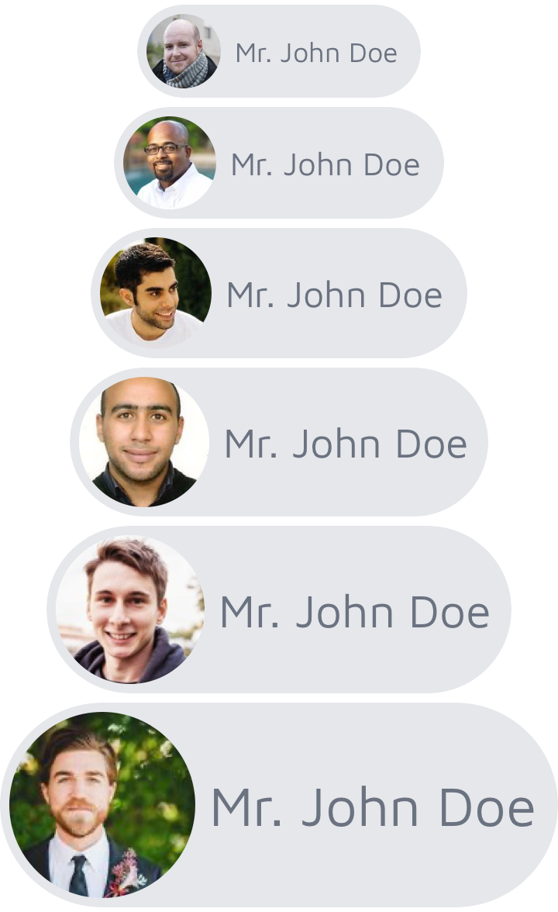
</p>

### `circular` & `square`

> **Properties:** `name` (optional, for accessibility), `image`, `border` (boolean)

Classic avatar shapes. Set `border="true"` for a default white border. Customize the border color using `classes` (e.g., `border-blue-500`).

```xml title="Circular Avatar with Custom Border"
<Avatar module="tikit.ui" variant="circular" size="base" border="true" image="https://randomuser.me/api/portraits/men/86.jpg" classes="border-gray-300" />
```

<p align="center">
  
</p>
<p align="center">
  
</p>

### `portrait` & `landscape`

> **Properties:** `name` (optional), `image`

Rectangular avatars. They have a default gray border (`border-gray-500`) which you can override using `classes`.

```xml title="Portrait Avatar with Custom Border"
<Avatar module="tikit.ui" variant="portrait" size="base" image="https://randomuser.me/api/portraits/men/87.jpg" classes="border-green-500" />
```

<p align="center">
  
</p>
<p align="center">
  
</p>

### `stacked`

> **Properties:** `image`, `last` (boolean)

Use these inside a `<View class="horizontal">` to create an overlapping stack. Set `last="true"` on the very last avatar in the stack to fix its right margin.

```xml title="Stacked Avatars Example"
<View class="horizontal">
  <Avatar module="tikit.ui" variant="stacked" size="base" image="https://randomuser.me/api/portraits/men/86.jpg" />
  <Avatar module="tikit.ui" variant="stacked" size="base" image="https://randomuser.me/api/portraits/women/87.jpg" />
  <Avatar module="tikit.ui" variant="stacked" size="base" image="https://randomuser.me/api/portraits/men/62.jpg" />
  <Avatar module="tikit.ui" variant="stacked" size="base" last="true" image="https://randomuser.me/api/portraits/women/88.jpg" />
</View>
```

<p align="center">
  
</p>

-----

## Buttons

> **Common Properties:** `variant`, `size`, `classes`, `title`

Essential for user actions and choices. Click, tap, go!

**TiKit Button Variants:**

  * `border`: Text with an outline border.
  * `border-rounded`: Like `border`, but with rounded corners.
  * `filled`: Solid background color with text.
  * `filled-rounded`: Like `filled`, but with rounded corners.
  * `icon-left`: Icon on the left, text on the right.
  * `icon-right`: Text on the left, icon on the right.

**Sizes:** Comes in `xs`, `sm`, `base`, `lg`, `xl`, and `2xl`.

```xml
<Button module="tikit.ui" variant="filled" size="lg" title="Submit" classes="bg-blue-500 text-white" />
```

### `border` & `border-rounded`

> **Property:** `title`

Simple outlined buttons. Use `classes` to control the border and text color (e.g., `border-purple-500 text-purple-500`).

```xml title="Border Button Example"
<Button module="tikit.ui" variant="border" size="base" title="Cancel" classes="border-red-500 text-red-500" />
```

<p align="center">
  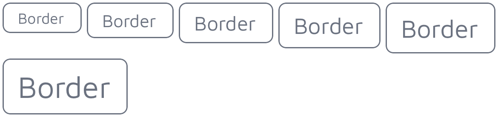
</p>
<p align="center">
  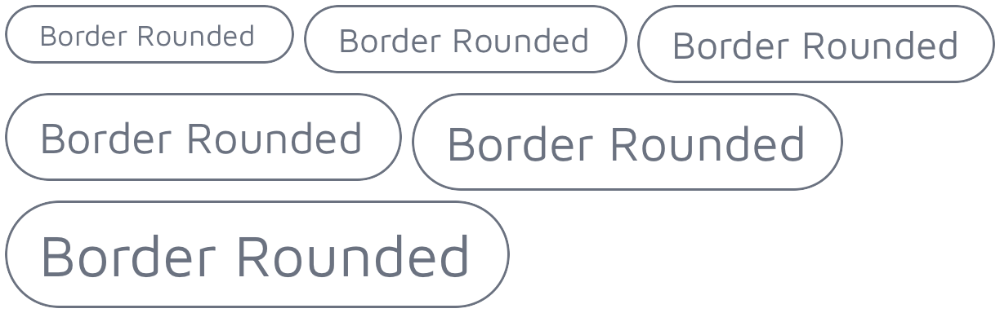
</p>

### `filled` & `filled-rounded`

> **Property:** `title`

Solid background buttons. Use `classes` to set background and text colors (e.g., `bg-green-600 text-white`).

```xml title="Filled Rounded Button Example"
<Button module="tikit.ui" variant="filled-rounded" size="base" title="Confirm" classes="bg-green-600 text-white" />
```

<p align="center">
  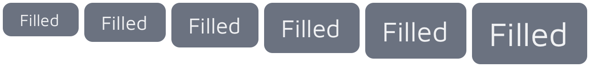
</p>
<p align="center">
  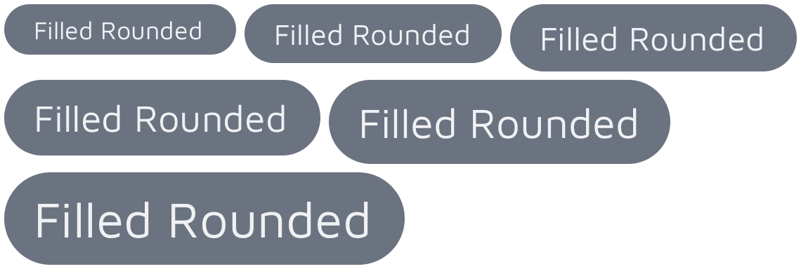
</p>

### `icon-left` & `icon-right`

> **Properties:** `title`, `icon`

Buttons with text and an icon. Use the `icon` property to specify the icon class (e.g., `fa fa-save`) and `classes` for background/text colors.

```xml title="Icon Left Button Example"
<Button module="tikit.ui" variant="icon-left" size="base" title="Save" icon="fa fa-save text-white" classes="bg-blue-500 text-white" />
```

<p align="center">
  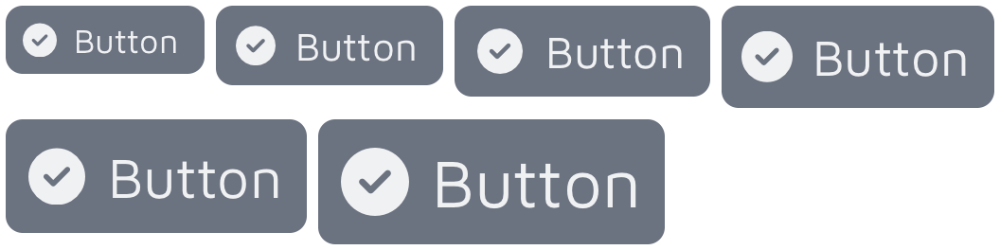
</p>

### Using Custom Icons in Buttons

You're not limited to the default icons! Use any icon font loaded via PurgeTSS. Just specify the font prefix and icon name in the `icon` property, along with any size or color classes from PurgeTSS.

```xml title="Button with Material Icon"
<Button module="tikit.ui" variant="icon-right" size="lg" title="Settings" icon="mi mi-settings text-lg text-gray-100" classes="bg-gray-700 text-gray-100" />
```

<p align="center">
  
</p>

-----

## Cards

> **Common Properties:** `variant`, `color`, `classes`

Cards group related content nicely. Great for summaries or showcasing items.

**TiKit Card Variants:**

  * `code`: Display code snippets, with an optional copy button.
  * `content`: For blocks of text with a main title and highlighted subtitle.
  * `quote`: Showcase a quote with attribution.
  * `showcase`: Combine an image with a title and description.

**Colors:** Available in `black`, `dark`, `light`, and `white` themes, affecting background and text colors.

```xml
<Card module="tikit.ui" variant="showcase" color="light" title="Featured Item" text="A brief description goes here." image="images/feature.png" />
```

### `code`

> **Properties:** `title`, `text`, `copy` (boolean)

Perfect for showing code examples. Set `copy="true"` to add a copy button.
*Pro Tip:* For best results, install a monospaced font (like Fira Code, JetBrains Mono) and configure `font-mono` in your PurgeTSS config.
*Localization:* The copy button uses `L('copy', 'Copy')` for its title and `L('code_copied', 'Code copied!')` for the confirmation message. Add these keys to your `strings.xml` files for translation.

```xml title="Code Card Example"
<Card module="tikit.ui" variant="code" color="dark" copy="true" title="Example Function" text="function hello() { console.log('Hi!'); }" />
```

<p align="center">
  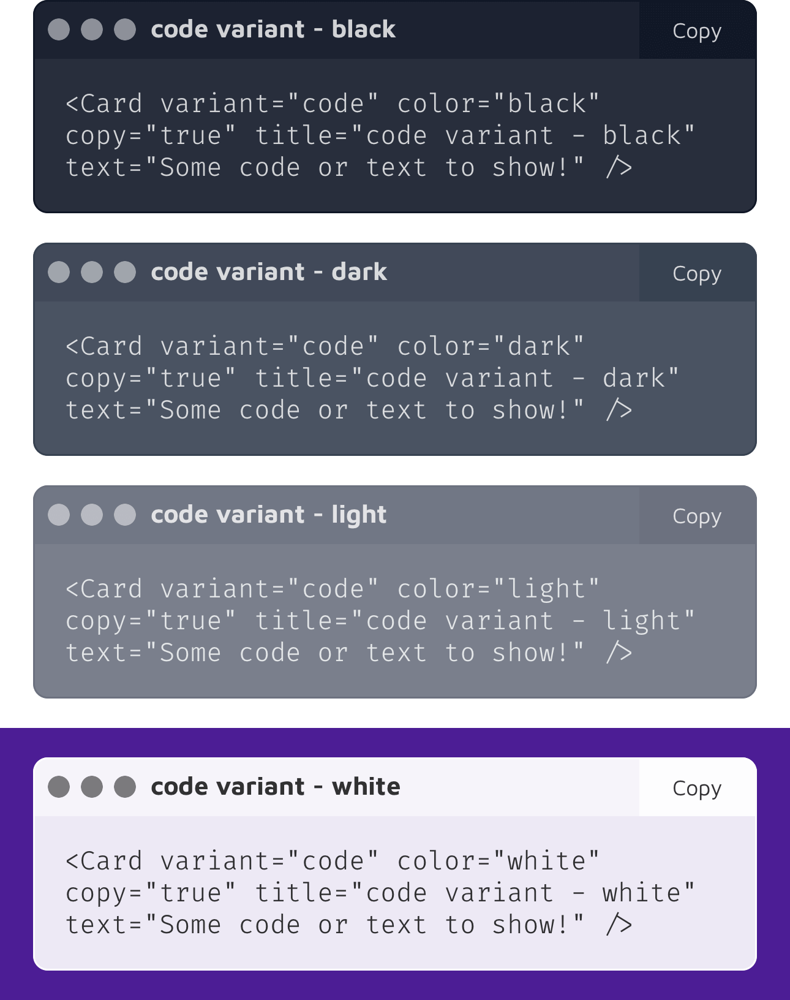
</p>

### `showcase`

> **Properties:** `title`, `text`, `image`, `rounded` (integer)

Perfect for displaying an image with a title and description text. The `rounded` property accepts any integer value (0 or greater) to control the border radius. Use `rounded=0` for sharp corners, or increase the value (like `rounded=12`) for more rounded corners.

```xml title="Showcase Card Example"
<Card module="tikit.ui" variant="showcase" color="black" title="Project X" text="Mobile app design concept." image="images/showcase/project-x.jpg" />
```

<p align="center">
  
</p>

### `quote`

> **Properties:** `name`, `text`

Display a quote attributed to someone.

```xml title="Quote Card Example"
<Card module="tikit.ui" variant="quote" color="white" name="Jane Austen" text="There is no charm equal to tenderness of heart." />
```

<p align="center">
  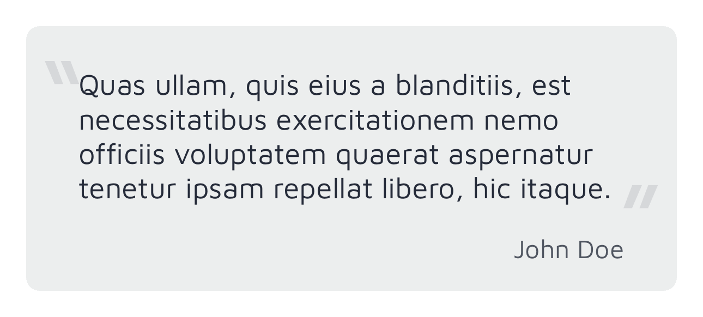 </p>

### `content`

> **Properties:** `title`, `subtitle`, `text`

Use this for presenting text content with a clear hierarchy: a large title, a highlighted subtitle, and the main body text.

```xml title="Content Card Example"
<Card module="tikit.ui" variant="content" color="light" title="About TiKit" subtitle="Making UI Easier" text="TiKit aims to provide useful components..." />
```

<p align="center">
  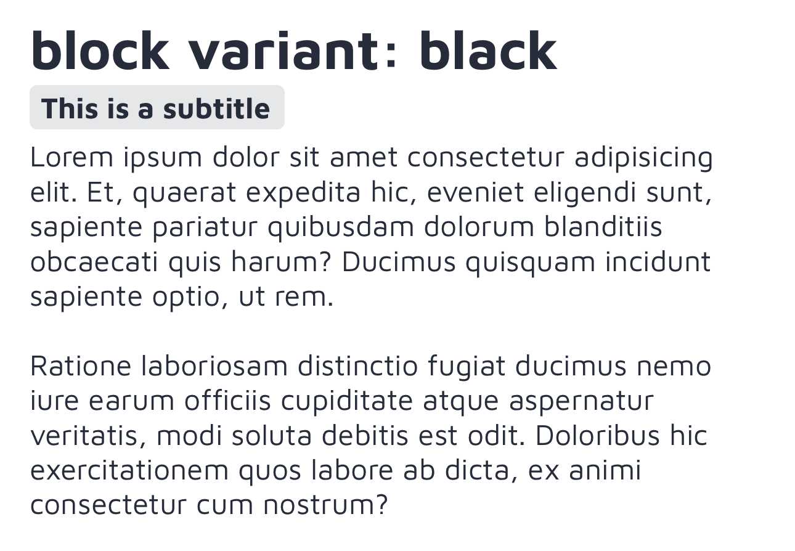
</p>

-----

## Forms

> **Common Properties:** `variant`, `color`, `classes`, `label`, `value`, `hintText`, `required`, `errorMessage`, `inputType`

Capture user input with consistent, themable form fields. Forms come with built-in validation helpers and a dedicated error label, so you don't have to wire that up by hand.

**TiKit Form Variants:**

  * `input`: A label, an input field (single-line `TextField` or multi-line `TextArea`), and an error label below.
  * `switch`: A label and a `Ti.UI.Switch` toggle below it.
  * `date`: A tappable field that opens a modal sheet with a native date picker. Stores the value as `YYYY-MM-DD`.
  * `time`: A tappable field that opens a modal sheet with a native time picker. Stores the value as `HH:mm`.
  * `select`: A tappable field that opens a modal sheet with a native plain picker. Options are passed as a JSON array; the picked option's `value` is what gets stored.

**Colors:** Each variant comes in `success`, `danger`, `warning`, `info`, `dark`, `light`, `white`, and `black`. You can also use `primary` and `secondary` if you've configured them with PurgeTSS shades.

**Extra Controls:**

  * `label` (string): Text shown above the input.
  * `value` (string | boolean): Initial value of the field. For `switch` accepts `"true"`/`"false"` or a real boolean. For `date`/`time` accepts the formatted string (`YYYY-MM-DD` / `HH:mm`). For `select` it must match one of the options' `value` field.
  * `hintText` (string): Placeholder shown when the input is empty (also used as the trigger placeholder for `date`/`time`/`select` when no value has been picked yet).
  * `required` (boolean): Makes the field mandatory for `isValid()` checks. **No-op on `switch`** — booleans are always defined.
  * `errorMessage` (string): Optional text for the error label below the input.
  * `inputType` (string): Pass `"textarea"` to render a multi-line `TextArea` instead of a `TextField` (`input` variant only).
  * `options` (array | JSON string): For `select` — array of `{ title, value }` objects. Can be passed as a stringified JSON via XML attribute or assigned from a controller.
  * `minDate` / `maxDate` (`YYYY-MM-DD` strings): For `date` only — restrict the selectable range.

```xml title="Basic Input Example"
<Form id="emailField" module="tikit.ui" variant="input" color="dark" label="Email" hintText="you@example.com" required="true" />
```

### Validating Forms

When you give the field an `id`, you can call helper methods on the proxy from your controller:

  * `getValue()`: Returns the current input value.
  * `isValid(showError)`: Returns `true` if the field passes validation. When the field is `required` and empty, it returns `false` and (unless `showError === false`) shows the localized error label `L('this_field_is_required', 'This field is required')`.

```javascript
function onSubmit() {
  if ($.emailField.isValid()) {
    var email = $.emailField.getValue()
    // ...send it off
  }
}
```

### Multi-line Input

Pass `inputType="textarea"` to swap the `TextField` for a `TextArea`:

```xml title="Textarea Example"
<Form module="tikit.ui" variant="input" color="dark" inputType="textarea" label="Notes" hintText="Anything we should know?" />
```

### Keyboard Configuration

Forms expose three layers for configuring the on-screen keyboard, from highest-level to lowest. Pick the one that fits the situation; they all coexist and the lower layers override the higher ones.

**Layer 1 — `type` (HTML-style shortcut):**

`type` is *not* a reserved Titanium property, so TiKit borrows the name and uses it the way HTML does — a single value that picks a sensible bundle of keyboard settings. This covers the common cases without making you remember Ti constants.

| `type=` | Keyboard | Autocorrect | Password mask |
|---|---|---|---|
| `"text"` *(default)* | Default | On | Off |
| `"email"` | Email | Off | Off |
| `"password"` | Default | Off | **On** |
| `"number"` | Number pad | Off | Off |
| `"decimal"` | Decimal pad | Off | Off |
| `"phone"` | Phone pad | Off | Off |
| `"url"` | URL | Off | Off |
| `"search"` | Web search | On | Off |

```xml
<Form module="tikit.ui" type="email"    label="Email"    hintText="you@example.com" />
<Form module="tikit.ui" type="password" label="Password" />
<Form module="tikit.ui" type="phone"    label="Mobile" />
```

**Layer 2 — Direct props (fine-grained):**

When `type` doesn't go far enough, pass the Titanium property names directly with friendly lowercase values. TiKit translates them to the right `Ti.UI.*` constant before applying.

| Prop | Accepted values | Notes |
|---|---|---|
| `keyboardType` | `default`, `ascii`, `decimal`, `email`, `namephone`, `number`, `numbers-punctuation`, `phone`, `twitter`, `url`, `websearch` | Cross-platform |
| `keyboardAppearance` | `default`, `dark`, `light` | iOS only (silent no-op on Android) |
| `returnKeyType` | `default`, `continue`, `done`, `go`, `google`, `join`, `next`, `route`, `search`, `send`, `yahoo`, `emergency-call` | Cross-platform — see TextArea note below |
| `enableReturnKey` | `"true"` or `"false"` | Disables the Return key until the field has content |
| `suppressReturn` | `"true"` or `"false"` | iOS only — fires `return` event instead of inserting a newline |
| `passwordMask` | `"true"` or `"false"` | Cross-platform |
| `clearOnEdit` | `"true"` or `"false"` | Android-only on TextArea (TextField cross-platform) |
| `maxLength` | A number | Cross-platform |
| `autocapitalization` | `none`, `sentences`, `words`, `all` | Cross-platform |
| `autocorrect` | `"true"` or `"false"` | Cross-platform — overrides whatever `type` set |
| `autofillType` | A `Ti.UI.AUTOFILL_TYPE_*` constant | Cross-platform — pass the constant directly |

```xml
<Form module="tikit.ui"
      type="email"
      keyboardAppearance="dark"
      returnKeyType="next"
      maxLength="120"
      label="Email" />
```

Direct props win over the bundle from `type` — useful when you want, say, an email keyboard with a `next` return key.

> **Android TextArea gotcha:** `returnKeyType` on a TextArea works very differently across platforms. On **iOS** it only changes the label on the Return key — pressing it still inserts a newline. On **Android** it replaces the IME action of the Enter key, which **suppresses the newline**. If you need users to insert line breaks on Android, leave `returnKeyType` as `default` (or omit it) on textareas.

**Layer 3 — PurgeTSS classes (escape hatch):**

For utility-class purists, the existing PurgeTSS classes still work via `classes`:

```xml
<Form module="tikit.ui" classes="keyboard-type-email keyboard-appearance-dark return-key-type-next" label="Email" />
```

> **Note:** `loginKeyboardType`, `passwordKeyboardType`, `loginReturnKeyType`, and `passwordReturnKeyType` are exclusive to `Ti.UI.AlertDialog` and aren't applicable to standalone form fields.

### Switch Variant

Toggle a boolean value with `variant="switch"`. The wrapper keeps the same vertical layout as `input` (label on top, control below).

```xml title="Switch Example"
<Form id="agree" module="tikit.ui" variant="switch" color="primary"
      label="Accept terms" value="false" />
```

```javascript
function onSubmit() {
  if ($.agree.getValue() === true) {
    // user agreed
  }
}
```

> `getValue()` returns a real boolean. `isValid()` is always `true` (a boolean is never empty). `update({ input: true })` flips the toggle programmatically.

### Date and Time Variants

`variant="date"` and `variant="time"` render a tappable field styled like the text input. Tapping opens a modal sheet with a native `Ti.UI.Picker` plus Cancel/OK buttons.

```xml title="Date Example"
<Form id="dob" module="tikit.ui" variant="date" color="dark"
      label="Birth date" value="2000-01-01"
      minDate="1900-01-01" maxDate="2026-12-31" />

<Form id="appt" module="tikit.ui" variant="time" color="dark"
      label="Appointment time" value="09:30" />
```

```javascript
$.dob.getValue()   // → "2000-01-01"
$.appt.getValue()  // → "09:30"
$.dob.update({ input: '1990-06-15' })  // re-formats the trigger label
```

> **Value format:** date is stored as `YYYY-MM-DD` and time as `HH:mm` — no timezone, no time-of-day for date — to keep values JSON-safe and free of timezone drift. The same format is what you pass into `value` and what you get back from `getValue()`.

### Select Variant

`variant="select"` renders a tappable field; tapping opens a modal sheet with a native plain picker populated from `options`.

```xml title="Select Example"
<Form id="size" module="tikit.ui" variant="select" color="primary"
      label="Size" required="true"
      options='[{"title":"Small","value":"S"},{"title":"Medium","value":"M"},{"title":"Large","value":"L"}]' />
```

You can also assign `options` from a controller — handy for dynamic lists:

```javascript
$.size.options = [
  { title: 'Small',  value: 'S' },
  { title: 'Medium', value: 'M' },
  { title: 'Large',  value: 'L' }
]
```

> **Stored value:** the option's `value` field, not its `title` (mirrors HTML `<select>`). `getValue()` returns the value of the picked option, or `''` if the user has not picked anything yet.

### Updating Form Fields

Forms expose `updateLabel`, `updateInput`, and `updateError` on the proxy, plus a generic `update(...)` that accepts any combination of those elements:

```javascript
function prefillForm() {
  $.emailField.update({
    label: 'Work email',
    input: 'user@example.com'
  })
}
```

You can also call the individual setters when you only need one element:

```javascript
$.emailField.updateError('That email is already taken')
```

-----

## Tabs

> **Properties:** `title`, `icon`, `activeIcon` (iOS only) + standard `Titanium.UI.Tab` properties

Need tabs for your `TabGroup`? TiKit makes it easy to add tabs with icons from your favorite font libraries (FontAwesome, Material Icons, etc.).

Specify the icon using `icon="fa fa-home"` or `icon="mi mi-settings"`. On iOS, you can provide a different icon for the active state using `activeIcon`.

```xml title="Tab Example"
<Tab module="tikit.ui" title="Home" icon="fa fa-home" activeIcon="fas fa-home">
  <Require src="home_window" />
</Tab>
```

### Styling Tabs Further

Since these are essentially `Titanium.UI.Tab` objects, you can use standard properties and PurgeTSS classes. For example, change the active tint color:

```xml
<Tab module="tikit.ui"
     class="active-tint-indigo-600 active-title-indigo-600"
     title="Profile"
     icon="mi mi-person_outline text-3xl"
     activeIcon="mi mi-person text-3xl">
  <Require src="profile_window" />
</Tab>
```

<p align="center">
  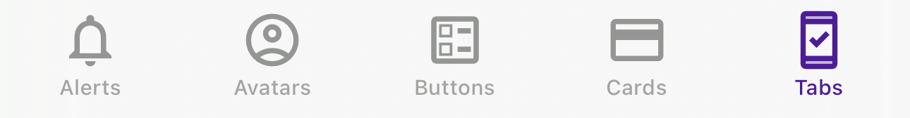
</p>

-----

## 🎨 Customizing Components

TiKit gives you three layers of customization that work together. Pick the layer that fits the situation:

### Layer 1 — Semantic presets (recommended for consistency)

Every component ships with a small set of named presets — `dark`, `light`, `white`, `black`, plus semantic colors like `success`, `danger`, `warning`, `info` (and `primary`, `secondary` if you've configured them). They cover the most common cases and communicate intent at a glance, the same way `btn-success` does in Bootstrap.

```xml
<Alert  module="tikit.ui" color="success" title="Saved!" />
<Card   module="tikit.ui" color="dark"    title="Status"    text="All good" />
<Button module="tikit.ui" color="primary" title="Submit"    icon="fa fa-check" />
<Form   module="tikit.ui" color="dark"    label="Email"     hintText="you@example.com" />
```

If a preset already says what you mean, use it. You'll get consistent visuals across the app for free.

### Layer 2 — Runtime overrides via `classes`

When a specific instance needs to break from the preset, pass PurgeTSS utility classes through the `classes` argument. TiKit distributes those classes to the right inner elements automatically:

| What you pass | Where it lands |
|---|---|
| `bg-*`, layout utilities | Wrapper / inner colored Views |
| `text-*`, `font-*` | Inner text Labels (`title`, `subtitle`, `text`, `name`, `label`, etc.) |
| `bg-*`, `text-*`, `hint-text-*`, `border-*`, `font-*`, `rounded`, `p-*` | Inner `TextField` / `TextArea` and Date/Time/Select trigger (Forms) |
| `tint-color-*`, `on-tint-*`, `thumb-*`, `on-thumb-*` | Inner `Ti.UI.Switch` (Forms `switch` variant) |

```xml title="Cards"
<Card module="tikit.ui"
      color="dark"
      classes="bg-blue-500/80 text-white"
      title="Custom card"
      text="Background and text color overridden." />
```

```xml title="Forms"
<Form module="tikit.ui"
      type="email"
      label="Email"
      classes="bg-pink-50 text-pink-800 hint-text-pink-300 border-pink-300" />
```

The wrapper gets background/layout classes; inner Labels get text/font classes; inner TextField/TextArea get the full visual set. You don't need to think about which element receives what — TiKit's filters handle it.

> **Composed transparency caveat:** Some presets layer transparency on top of the color (e.g. `text-{color}/80` for secondary text in Cards). When you pass a runtime `text-blue-500`, the `/80` is replaced with full opacity. To preserve the soft-text effect, pass `text-blue-500/80` (or whatever shade you want) explicitly.

### Layer 3 — Define your own presets in PurgeTSS

If the same override keeps showing up, promote it to a project-wide preset. Open your `tailwind.config.js` and either fill in `primary` / `secondary` (which TiKit components already pick up via `color="primary"` / `color="secondary"`) or add brand-new colors:

```javascript title="tailwind.config.js"
module.exports = {
  theme: {
    extend: {
      colors: {
        primary: {
          50:  '#eef2ff',
          // …shade scale up to 950
          DEFAULT: '#4f46e5'
        },
        brand: {
          // any custom palette you want to reuse
          500: '#14b8a6',
          600: '#0d9488'
        }
      }
    }
  }
}
```

Run `purgetss build` and your project now exposes `bg-primary`, `text-brand-500`, etc. — usable in `classes` everywhere TiKit accepts them, and `color="primary"` automatically themes any preset-aware component.

### Which layer should I reach for?

- **One-off look for a single instance** → Layer 2 (`classes`).
- **Same custom look used across the app** → Layer 3 (define a PurgeTSS preset).
- **Communicating semantic intent** (`success`, `danger`, etc.) → Layer 1.

You can mix all three on the same component without conflicts.

-----

## ✨ Updating Components Dynamically

One of the coolest things about TiKit is that you don't need to destroy and recreate components just to change simple things like text or an image. This makes your app feel more responsive!

When you give a TiKit component an `id` in your XML, you can access special methods in your controller (`.js` file) to update it.

**Why is this useful?**

  * Update a Card's text when new data loads from an API.
  * Change an Avatar image after the user uploads a new photo.
  * Modify an Alert message based on user actions.
  * Change a Button's title or icon (e.g., from "Save" to "Saving..." and back).

### Available Update Methods:

You can call these on your component's proxy (e.g., `$.myCard.updateTitle(...)`):

1.  **`updateTitle(newTitle)`**: Changes the main title.
2.  **`updateSubtitle(newSubtitle)`**: Changes the subtitle (mainly for Cards).
3.  **`updateText(newText)`**: Changes the main text content.
4.  **`updateName(newName)`**: Changes the name (useful for Avatar `chip` variant).
5.  **`updateImage(newImage)`**: Changes the image (path or blob).
6.  **`updateIcon(newIcon)`**: Changes the icon class string (for Alerts, Buttons).
7.  **`updateLabel(newLabel)`**: Changes the label text (Forms).
8.  **`updateInput(newValue)`**: Sets the input value (Forms).
9.  **`updateError(newError)`**: Sets the error label text (Forms).
10. **`update(args)`**: A handy shortcut to update multiple elements at once. Pass an object whose keys match the elements that component exposes — e.g. `{ title: 'New', text: 'Updated text' }` for a Card, or `{ label: 'Email', input: 'user@example.com' }` for a Form. Unknown keys are ignored with a warning.

### Which Components Support Updates?

  * **Cards (`<Card>`)**: `title`, `subtitle`, `text`, `image` (Works across variants where applicable).
  * **Avatars (`<Avatar>`)**: `image`, `name` (`name` mostly for `chip`).
  * **Alerts (`<Alert>`)**: `title`, `text`, `icon` (`text` not applicable to `solid`).
  * **Buttons (`<Button>`)**: `title`, `icon` (`icon` for `icon-left`/`icon-right`).
  * **Forms (`<Form>`)**: `input`, `label`, `error` — plus `getValue()` and `isValid()` helpers.

### Example: Updating a Card

**View (index.xml):**

```xml
<Alloy>
  <Window>
    <View class="vertical mx-4 my-8">
      <Card id="statusCard" module="tikit.ui" variant="content" color="light"
            title="Status"
            subtitle="Current"
            text="Waiting for update..." />

      <Button module="tikit.ui" variant="filled" size="base"
              title="Fetch Status" onClick="fetchStatus"
              classes="mt-4 bg-blue-500 text-white" />
    </View>
  </Window>
</Alloy>
```

**Controller (index.js):**

```javascript
function fetchStatus() {
  // Simulate fetching data...
  $.statusCard.update({
      title: 'Status Updated!',
      subtitle: 'Just Now',
      text: 'Everything looks good. System operational.'
  });

  // You could also update individually:
  // $.statusCard.updateTitle('Status Updated!');
  // $.statusCard.updateSubtitle('Just Now');
  // $.statusCard.updateText('Everything looks good...');
}
```

This makes handling dynamic content much cleaner!

-----

## Working with Icon Fonts

Icons add a lot of visual appeal! PurgeTSS helps manage icon fonts easily.

### Using Official Icon Fonts

Want to quickly add popular free icon sets? Use the PurgeTSS command:

```bash
# Add Font Awesome (fa), Material Icons (mi), Material Symbols (ms), Framework7 (f7)
purgetss icon-library --vendor=fa,mi,ms,f7
```

This copies the necessary font files and CSS into your project, ready to use.

### Adding Your Own Custom Icon Fonts

Got a specific icon font you love? No problem!

1.  **Organize Files**: Place your font (`.ttf` or `.otf`) and its CSS file (mapping icon names to Unicode characters) in the PurgeTSS fonts directory:

    ```
    YourProject/
    └── purgetss/
        └── fonts/
            └── your-cool-font-name/  <-- Create this folder
                ├── cool-font.css
                └── cool-font.ttf
    ```

2.  **Build Fonts**: Run the PurgeTSS command to process them:

    ```bash
    purgetss build-fonts
    ```

    This generates the necessary TSS classes in `fonts.tss`.

3.  **Use in TiKit**: Now you can use your custom icons just like the built-in ones!

    ```xml
    <Button module="tikit.ui" variant="icon-left" title="Launch"
            icon="myicon myicon-rocket text-lg"
            classes="bg-purple-600 text-white" />

    <Alert module="tikit.ui" variant="pop" color="info"
           title="Update Available"
           icon="myicon myicon-download text-2xl" />
    ```

You can mix and match icons from different libraries throughout your app. Super flexible!

-----

## License

TiKit UI Components is open source and shared under the MIT License. Feel free to use and adapt it!

```
MIT License

Copyright (c) 2023-2025 César Estrada

Permission is hereby granted, free of charge, to any person obtaining a copy
of this software and associated documentation files (the "Software"), to deal
in the Software without restriction, including without limitation the rights
to use, copy, modify, merge, publish, distribute, sublicense, and/or sell
copies of the Software, and to permit persons to whom the Software is
furnished to do so, subject to the following conditions:

The above copyright notice and this permission notice shall be included in all
copies or substantial portions of the Software.

THE SOFTWARE IS PROVIDED "AS IS", WITHOUT WARRANTY OF ANY KIND, EXPRESS OR
IMPLIED, INCLUDING BUT NOT LIMITED TO THE WARRANTIES OF MERCHANTABILITY,
FITNESS FOR A PARTICULAR PURPOSE AND NONINFRINGEMENT. IN NO EVENT SHALL THE
AUTHORS OR COPYRIGHT HOLDERS BE LIABLE FOR ANY CLAIM, DAMAGES OR OTHER
LIABILITY, WHETHER IN AN ACTION OF CONTRACT, TORT OR OTHERWISE, ARISING FROM,
OUT OF OR IN CONNECTION WITH THE SOFTWARE OR THE USE OR OTHER DEALINGS IN THE
SOFTWARE.
```
