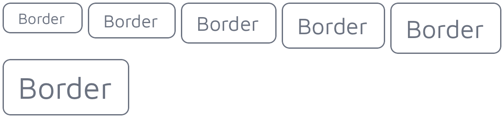

# Welcome to TiKit UI Components

<div align="center">


</div>

TiKit is a collection of UI components for **Titanium SDK**, built on top of **Alloy** and **PurgeTSS**.


## Installation
To install it, run the following command in the terminal:

```bash
> [sudo] npm install -g tikit
```

Ensure that you also have **PurgeTSS** installed:

```bash
> [sudo] npm install -g purgetss
```


## Installing the components
Once everything is installed on your machine, create a new Alloy project using **PurgeTSS**. Ensure that you have the `app.idprefix` and `app.idprefix` [settings configured.](https://purgetss.com/docs/commands/#requirements)*

```bash
> purgetss create myApp
```

Next, run `tikit install` and follow the interactive selection prompt:

```bash
> tikit install
? Choose a component to install › - Use arrow-keys. Return to submit.
❯   all components
    alerts
    avatars
    buttons
    cards
```


# Available components and their variants


## Alerts
> ### General properties: variant, color, and classes

An alert is designed to display a concise and crucial message, capturing the user's attention without disrupting their ongoing task.

**The TiKit Alert Component includes three variants:**
* callout
* pop
* solid

Each of these variants comes in six primary colors: *success*, *danger*, *warning*, *info*, *dark*, and *light*.

Additionally, there are two custom colors available for each variant, named *primary* and *secondary*.

You can introduce your custom color values using the `shades` command in **PurgeTSS**:

```bash
> purgetss shades '#hexcode1' primary
> purgetss shades '#hexcode2' secondary
```

> ### Additional properties: delay, duration, and dismissible

Use the `delay` property to specify when the alert should appear after a specified time, and the `duration` property to control the speed of the animation. Both of these properties are measured in milliseconds.

Set the `dismissible` property to true if you want the alert to close when the user clicks or taps on it.

```xml
<Alert module="tikit.ui" variant="pop" color="info" delay="500" dismissible="true" title="Dismissible Alert" text="Lorem ipsum dolor sit..." />
```


### callout
> ### Properties: title and text

This represents a simple alert with a title and a concise description.

```xml title="callout variant"
<Alert module="tikit.ui" variant="callout" color="success" title="Callout variant" text="Lorem ipsum dolor sit..." />
```


<p align="center">
  
</p>


### pop
> ### Properties: title, text, and icon

The "pop" variant of alerts is designed to include a predefined icon that highlights the message.

You can employ icon fonts like FontAwesome, Material Icons, or any other icon font of your preference.

Modify the icon by utilizing the `icon` property, and adjust its size using any of **PurgeTSS**'s font size classes:

```xml title="pop variant with custom icon"
<Alert module="tikit.ui" variant="pop" color="primary" title="Primary Alert with custom Icon" text="Lorem ipsum dolor sit..." icon="mi mi-pending_actions text-3xl" />
```

<p align="center">
  
</p>


### solid
> ### Properties: title and icon

The "solid" variant represents a full-width, solid banner that includes a title and a predefined icon.

Similar to the `pop` variant, you can customize its icon using the `icon` property and adjust its size by utilizing any of **PurgeTSS**'s font size classes.

```xml title="solid variant with custom icon"
<Alert module="tikit.ui" variant="solid" color="primary" title="Primary Alert with custom Icon" icon="mi mi-pending_actions text-2xl" />
```

<p align="center">
  
</p>


## Avatars
> ### General properties: variant, size, and classes

Avatars are a useful tool for representing people or objects and can serve as visual identifiers for user profiles within your app.

**The TiKit Avatar Component offers six variants:**

* chip
* circular
* landscape
* portrait
* square
* stacked

**Each variant comes in six different sizes**: *xs*, *sm*, *base*, *lg*, *xl* and *2xl*.

```xml title="Avatar Component"
<Avatar module="tikit.ui" variant="chip" size="base" name="John Doe" image="link-to-image.jpg" />
```


### chip
> ### Properties: name, and image

The "chip" variant allows you to specify the name of the person and an image to display. You can use a local filesystem path, a remote URL, or a Blob object containing image data.

By default, the colors for the "chip" variant are set to `bg-gray-200` and `text-gray-500`. If you wish to change these colors, you can do so using the classes property, as demonstrated in the example below.

```xml title="chip variant with custom colors"
<Avatar module="tikit.ui" variant="chip" size="base" name="Mr. John Doe" image="https://randomuser.me/api/portraits/men/86.jpg" classes="bg-violet-900 text-violet-50" />
```

<p align="center">
  
</p>


### circular
> ### Properties: name, image, and border

For the "circular" variant, you can specify the name, image, and whether to display a white border around the image. Set the `border` property to true to show the white border.

To further customize the border color, you can utilize the `classes` prop.

```xml title="circular variant with custom colors"
<Avatar module="tikit.ui" variant="circular" size="base" border="true" image="https://randomuser.me/api/portraits/men/86.jpg" />
```

<p align="center">
  
</p>


### square
> ### Properties: name, image, and border

In the "square" variant, you can define the name, image, and choose whether to display a white border around the image. To enable the white border, set the `border` property to true.

For additional control over the border color, you can make use of the `classes` prop.

```xml title="square variant with custom colors"
<Avatar module="tikit.ui" variant="square" size="base" border="true" classes="border-violet-900" image="https://randomuser.me/api/portraits/men/86.jpg" />
```

<p align="center">
  
</p>


### portrait
> ### Properties: name and image

The "portrait" variant allows you to specify the name and image. To customize the border color, utilize the `classes` prop.

By default, the border color is set to `border-gray-500`. To change this color, you can make use of the `classes` prop.

```xml title="portrait variant with custom colors"
<Avatar module="tikit.ui" variant="portrait" size="base" classes="border-violet-900" image="https://randomuser.me/api/portraits/men/86.jpg" />
```

<p align="center">
  
</p>


### landscape
> ### Properties: name and image

The "landscape" variant permits you to define the name and image. If you want to modify the border color, you can do so using the `classes` prop.

By default, the border color is set to `border-gray-500`. To alter this color, utilize the `classes` prop.

```xml title="landscape variant with custom colors"
<Avatar module="tikit.ui" variant="landscape" size="base" classes="border-violet-900" image="https://randomuser.me/api/portraits/men/86.jpg" />
```

<p align="center">
  
</p>


### stacked
> ### Properties: title, icon, and last

In the "stacked" variant, you can specify the title, icon, and use the `last` property to properly adjust the right margin of the last avatar in a stack. Setting `last` to true for the last avatar ensures the appropriate right margin.

```xml title="stacked variant"
<View class="horizontal">
  <Avatar module="tikit.ui" variant="stacked" size="base" image="https://randomuser.me/api/portraits/men/86.jpg" />
  <Avatar module="tikit.ui" variant="stacked" size="base" image="https://randomuser.me/api/portraits/men/87.jpg" />
  <Avatar module="tikit.ui" variant="stacked" size="base" image="https://randomuser.me/api/portraits/men/62.jpg" />
  <Avatar module="tikit.ui" variant="stacked" size="base" last="true" image="https://randomuser.me/api/portraits/men/88.jpg" />
</View>
```

<p align="center">
  
</p>


## Buttons
> ### General properties: variant, size, and classes

Buttons are interactive elements that enable users to take actions or make choices.

**The TiKit Button Component offers six variants:**
* border
* border-rounded
* filled
* filled-rounded
* icon-left
* icon-right

**Each variant is available in six different sizes**: *xs*, *sm*, *base*, *lg*, *xl* and *2xl*.

```xml
<Button module="tikit.ui" variant="border" size="lg" title="Button Name" />
```


### border
> ### Property: title

For the "border" variant, you can set the title. To change the color of the title and border, utilize the `classes` property.

```xml title="border variant"
<Button module="tikit.ui" variant="border" size="base" title="Border" classes="border-violet-900 text-violet-900" />
```

<p align="center">
  
</p>


### border-rounded
> ### Property: title

In the "border-rounded" variant, you can specify the title. To customize the color of both the title and border, make use of the `classes` property.

```xml title="border-rounded variant"
<Button module="tikit.ui" variant="border-rounded" size="base" title="Border Rounded" classes="border-violet-900 text-violet-900" />
```

<p align="center">
  
</p>


### filled
> ### Property: title

For the "filled" variant, you can set the title. To modify the color of both the title and the background, utilize the `classes` property.

```xml title="filled variant"
<Button module="tikit.ui" variant="filled" size="base" title="Filled" classes="text-violet-50 bg-violet-900" />
```

<p align="center">
  
</p>


### filled-rounded
> ### Property: title

In the "filled-rounded" variant, you can specify the title. To customize the color of both the title and background, make use of the `classes` property.

```xml title="filled-rounded variant"
<Button module="tikit.ui" variant="filled-rounded" size="base" title="Filled Rounded" classes="text-violet-50 bg-violet-900" />
```

<p align="center">
  
</p>


### icon-left
> ### Properties: title and icon

For the "icon-left" variant, you can set the title and use the `icon` property to change its icon, color, and size.

Additionally, you can modify the color of the title and background by using the `classes` property.

```xml title="icon-left variant"
<Button module="tikit.ui" variant="icon-left" size="base" title="Button" icon="fa fa-file text-violet-50" classes="text-violet-50 bg-violet-900" />
```

<p align="center">
  
</p>


### icon-right
> ### Properties: title and icon

In the "icon-right" variant, you can specify the title and utilize the `icon` property to adjust its icon, color, and size.

For further customization, such as changing the color of the title and background, utilize the `classes` property.

```xml title="icon-right variant"
<Button module="tikit.ui" variant="icon-right" size="base" title="Button" icon="fa fa-file text-violet-50" classes="text-violet-50 bg-violet-900" />
```

<p align="center">
  
</p>


### Custom Icons
> ### Use any Icon Font Library

You have the flexibility to switch to a different icon from the FontAwesome Icon Library or even opt for a different font vendor. You can achieve this by setting the `icon` property with the appropriate font and icon classes, like `fa fa-file-pdf` or `mi mi-pending_actions`.

Furthermore, you can adjust the icon's size using any of PurgeTSS's font size classes, such as `text-lg` or `text-2xl`.

In the following example, we demonstrate the use of the Material Icons font library.

```xml title="Custom icon and color"
<Button module="tikit.ui" variant="icon-left" size="base" icon="mi mi-pending_actions text-2xl text-violet-50" title="Pending Actions" classes="my-4 font-bold bg-violet-900" />
```

<p align="center">
  
</p>


## Cards
> ### General properties: variant, color, and classes

Cards are a valuable tool for grouping and presenting content in a readable manner, often serving as an introduction to more comprehensive information.

**The TiKit Card Component offers four variants:**
* code
* content
* quote
* showcase

**Each variant is available in four different colors**: *black*, *dark*, *light* and *white*.

```xml
<Card module="tikit.ui" variant="code" color="black" copy="true" title="Card Title" text="Some code or text to display!" />
```


### code
> ### Properties: title, text, and copy

The "code" variant is specifically designed for displaying small snippets of code.

You can employ the `copy` property to include a copy button at the top-right corner. The button's title and the alert message are set using Titanium's localization function: `L('copy', 'Copy')` and `L('code_copied', 'Code copied to clipboard!')`, respectively. To personalize and translate these strings, add both "copy" and "code_copied" to your app's target languages (e.g., `app/i18n/xx/strings.xml`).

To enhance the appearance of your code snippets, install a monotype font family of your choice and create a `font-mono` style in `./purgetss/config.js`. In all our examples, we utilize the `FiraCode-Light` font family.

<p align="center">
  
</p>


### showcase
> ### Properties: title, text, and image

The "showcase" variant is intended for scenarios where you want to showcase an image alongside a title and a brief description. This variant is particularly useful when you need to present visual content with accompanying information.

```xml title="showcase variant"
<Card module="tikit.ui" variant="showcase" color="black" title="Pocket" text="Mobile app marketing website" image="images/showcase/1.png" />
```

<p align="center">
  
</p>


### quote
> ### Properties: name and text

The "quote" variant is designed for situations where you want to display a quotation from someone. This variant allows you to attribute the quote to its source by specifying the name of the person or entity and the text of the quote itself. It's an effective way to showcase quotes within your content.

```xml title="quote variant"
<Card module="tikit.ui" variant="quote" color="black" name="John Doe" text="Quas ullam, quis eius a blanditiis..." />
```

<p align="center">
  
</p>


### content
> ### Properties: title, subtitle, and text.

The "content" variant is suitable for presenting a block of text content with the following features:

- A large title
- A highlighted subtitle
- Paragraphs of text

This variant is ideal for displaying textual information where you want to emphasize the title and subtitle while providing detailed content in paragraphs.

```xml title="content variant"
<Card module="tikit.ui" variant="content" color="black" title="content variant, black" subtitle="This is a subtitle" text="Alloy.Globals.lorem" />
```

<p align="center">
  
</p>


## Tabs
The Tab component provides an instance of **Titanium.UI.Tab**, featuring a custom icon created using an icon font, such as FontAwesome, Material Icons, or any other font of your preference.

By configuring the `title`, `icon`, and `activeIcon` (iOS only) properties, you can create a Tab component with well-rendered icons.

The `icon` property combines the icon font name and the icon code, like `fa fa-home` or `mi mi-home`.

```xml title="Tab component"
<Tab module="tikit.ui" title="Email" icon="far fa-envelope" activeIcon="fas fa-envelope">
  <!-- tab’s-window-content -->
</Tab>
```


### Additional properties

These are standard **Titanium.UI.Tab** objects, so you can utilize all the properties and methods available for them.

For instance, you can set the active tint and title color for each tab using the `activeTintColor` and `activeTitleColor` properties, as demonstrated below:

```xml
<Tab module="tikit.ui" class="active-tint-violet-900 active-title-violet-900" title="Tabs" icon="mio mi-security_update_good text-3xl" activeIcon="mit mi-security_update_good text-3xl">
  <Require src="sections/tabs" />
</Tab>
```

<p align="center">
  
</p>


## Official Icon Fonts in PurgeTSS

To incorporate the free versions of Font Awesome, Material Icons, Material Symbols, or Framework7 Icons into your project, you can use the `icon-library` command in **PurgeTSS**:

```bash
> purgetss icon-library --vendor=fa,mi,ms,f7
```

Here's what each vendor abbreviation stands for:

- `fa` or `fontawesome` represents Font Awesome Icons.
- `mi` or `materialicons` stands for Material Icons.
- `ms` or `materialsymbol` corresponds to Material Symbols.
- `f7` or `framework7` is used for Framework7 Icons.

Running this command allows you to conveniently copy these icon font libraries into your project for use in your UI components.
